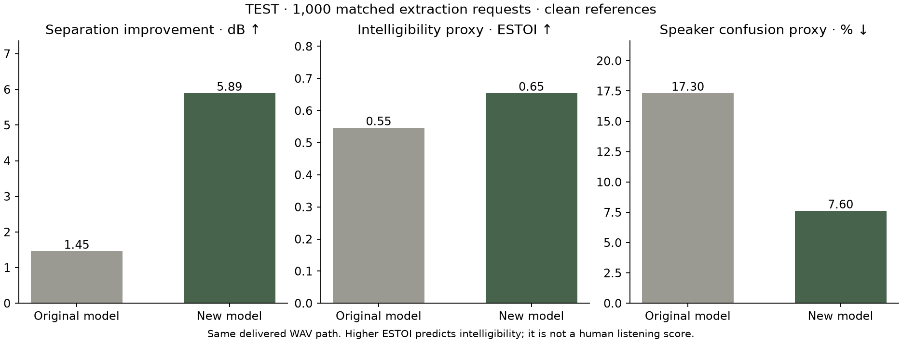
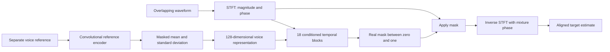

# One voice · Target Speaker Extraction

An independently implemented PyTorch system that estimates one person's voice from two overlapping speakers, guided by a separate voice sample. Includes training, data preparation, evaluation, a local API, and a browser audio workspace.

**Experimental research software.** It can select the wrong speaker and distort speech. The requested speaker must be present. Live microphone use and production speech quality are outside this release's claims.

The current experiment improves speaker separation after the first model left competing speech and audible artifacts. It combines an independently implemented spectral separator, speaker supervision, a larger training corpus and checkpoint averaging. There is no SpeakerBeam source, checkpoint, or dependency. The original controlled reference-augmentation experiment remains available in the [v0.1.0 case study](docs/CASE_STUDY_V0_1.md).

The active experiment is [full-data training with pause and resume](docs/FULL_DATA_TRAINING.md): fresh random weights, all **251 speakers and 13,900 Libri2Mix train-100 mixtures**, and a **100-epoch schedule** using the efficient three-block model. Training runs without a session time limit until the full schedule completes or it is manually paused. [Live full-data progress](http://127.0.0.1:8000/experiments/full/) provides pause/resume controls and separate latest/best development results.

The [eight-voice concept experiment](docs/CONCEPT_DEMO.md) is preserved at update 6,000, with its best 32-request development improvement of **6.66 dB** at update 5,350. This is a familiar-voice score and cannot be compared directly with the new run's unseen development speakers. The slower [six-block reference baseline](docs/REFERENCE_BASELINE.md) and [compact v3 experiments](docs/V3_WORKLOG.md) remain preserved. The default app still serves v0.2.0.

## Frozen v0.2.0 results

The selected model achieves **5.89 dB mean SI-SDR improvement** on 1,000 fresh test requests from 20 reserved speaker identities, versus **1.45 dB** for the original model on the same requests. The paired gain is 4.43 dB, with an approximate 95% target-speaker-cluster interval of 3.46–5.53 dB. Selection was frozen before scoring this test.

| Metric on the same fresh test | Original model | v0.2.0 |
| --- | ---: | ---: |
| Mean SI-SDR improvement | 1.45 dB | 5.89 dB |
| ESTOI intelligibility proxy | 0.5457 | 0.6534 |
| Requests worse than the mixture | 30.8% | 13.9% |
| Speaker confusion proxy | 17.3% | 7.6% |

These results show stronger extraction while retaining substantial failures. ESTOI is not word accuracy or a human listening rating; static is not established to be eliminated. The [model card](docs/MODEL_CARD.md) specifies uncertainty, metric definitions, artifact hashes and limits. The [case study](docs/CASE_STUDY.md) explains the diagnosis and experiments.

The main run completed 20,000 updates using 231 speakers and 90.582 eligible source hours. The release averages its 16,000-, 18,000- and 20,000-update checkpoints and initializes from earlier training within this project. A separate matched 2,000-update normalization comparison was completed and not selected. [Development record](docs/QUALITY_WORKLOG.md), [selection freeze](reports/quality-v2-selection.json).

The [research alignment audit](docs/RESEARCH_AUDIT.md) compares our implementation with SpeakerBeam, SpEx, Conv-TasNet and the enrollment-augmentation paper. This is a custom system informed by research, not a reproduction of their published architectures or training recipes.

Warm processing of a repeated 60-second development recording takes **0.47 seconds on MPS** or **5.95 seconds on CPU** on the Apple M3 Pro, including file decode and WAV encode. This is offline throughput, not live latency or a natural long-conversation quality result. Exact output length and agreement with whole-recording processing were verified at 10/30/60 seconds.



## Run locally

Python 3.12 and [uv](https://docs.astral.sh/uv/) are required. On the project Mac, the environment, public data, and training artifacts are in the ignored `.venv/`, `data/`, and `artifacts/` directories.

```sh
uv sync --frozen
uv run tse serve --device mps
```

Open <http://127.0.0.1:8000>. Select the development examples or supply a WAV/FLAC mixture up to 60 seconds and a separate 3–10 second voice reference. The interface provides waveform previews, synchronized original/output playback, and WAV download. Audio stays in the local service.

Use `--device cpu` without Apple MPS. The [local listening gallery](http://127.0.0.1:8000/gallery/) includes 20 fixed development requests with mixture, reference, known target, and model output, including successes and failures.

The [matched-volume comparison](http://127.0.0.1:8000/gallery/quality-progress/) puts the original and updated estimates beside the known target. Matching is a labeled listening aid; normal inference only attenuates sample peaks above 0.98 and never boosts quiet estimates.

Serving requires `artifacts/releases/model.pt`, created by the study or export command. A fresh clone contains source and reports; raw audio and weights are not stored in Git. A missing model produces a not-ready state.

## Reproduce the experiments

Follow the [quality reproduction guide](docs/REPRODUCING_QUALITY.md) for the v0.2.0 data reservation, initialization lineage, training, averaging, frozen evaluation and export commands. Public source identities, mixture recipes, training records and checksums are in [`metadata/quality-v2/`](metadata/quality-v2/). The main run's 20,000 updates do not include earlier project training used for initialization.

The original paired reference-augmentation study has its own [historical reproduction guide](docs/REPRODUCING.md) and [model card](docs/MODEL_CARD_V0_1.md). Its 1.73 dB result comes from a different, already opened test and must not be substituted for the paired fresh-test baseline above.

Training resumes from atomic checkpoints. Reproduction requires substantial time and network access. The recorded machine is an Apple M3 Pro with 18 GiB memory. Once a test is opened, use a new generalization protocol for subsequent test-informed development.

## What is implemented

- Audited public audio acquisition, SHA-256 manifests, speaker-disjoint splits, distinct reference utterances, and deterministic paired mixtures.
- A spectral separator with a learned reference encoder, 18 conditioned temporal blocks, bounded real masks and inverse STFT. The selected checkpoint loads 2,260,586 parameters, including its training speaker head. All weights originate from this project's training.
- AdamW training, accumulation, clipping, explicit CPU/MPS devices, development checkpoint selection, verified CPU resume, and structured provenance.
- Target-specific SI-SDR improvement, ESTOI, speaker confusion, artifact diagnostics, paired clustered uncertainty and reserved test cases. The original study additionally evaluates five reference conditions and duration/absence diagnostics.
- Bounded long-file inference, input validation, a local multipart API, and a responsive audio workspace.
- A dependency lock, automated tests, Linux CPU CI, wheel packaging, and a CPU container recipe.

This is an independent implementation and controlled engineering study. Established ideas and datasets are attributed in [sources](docs/SOURCES.md); the project does not claim to have invented target speaker extraction.

## Architecture



The model is noncausal and processes recorded audio offline. Processing faster than the recording duration does not establish suitability for live calls.

## Commands and checks

```sh
uv run tse --help
uv run tse extract --mixture conversation.wav --reference voice.wav --output isolated.wav --device cpu
uv run tse data audit
uv run ruff check src tests scripts
uv run ruff format --check src tests scripts
uv run pytest -q
uv build
```

The API exposes `GET /health`, `GET /ready`, `GET /model`, and `POST /extract` with multipart `mixture` and `reference` files. Successful responses contain a float WAV and an `X-TSE-Metadata` header. See `/docs` on the local server.

## Review the project

| Document | Purpose |
| --- | --- |
| [Model card](docs/MODEL_CARD.md) | Frozen test results, artifact identity, runtime and limitations |
| [Technical case study](docs/CASE_STUDY.md) | Research question, implementation choices and findings |
| [Quality reproduction guide](docs/REPRODUCING_QUALITY.md) | Current data, training, selection, inference and verification |
| [Research audit](docs/RESEARCH_AUDIT.md) | Primary-source comparison and limits of research alignment |
| [Implementation record](docs/IMPLEMENTATION.md) | Actual decisions and differences from the initial proposal |
| [Roadmap](docs/ROADMAP.md) | Delivery evidence and remaining research |
| [Original project plan](docs/PROJECT_PLAN.md) | Scope, hypotheses and proposed success criteria |
| [Original evaluation plan](docs/EVALUATION.md) | Experiment rationale and acceptance targets |
| [Sources](docs/SOURCES.md) | Data origins and primary research references |

Machine-readable results live in [`reports/`](reports/). Targets in the original proposal are not measured results. Quality claims must identify their split, checkpoint, and report.

Public source identities, frozen recipes and training records are in [`metadata/`](metadata/). Automated tests run locally and in Linux CPU CI. The v0.2.0 wheel was installed separately and exercised with the selected export on CPU and MPS using the locked project dependencies. The v0.1.0 release additionally records real browser extraction through a non-root CPU container; that historical container check is not a new v0.2.0 execution.

## Data and licensing

Speech comes from [LibriSpeech / OpenSLR 12](https://www.openslr.org/12), distributed under [CC BY 4.0](https://creativecommons.org/licenses/by/4.0/). Examples are cropped, normalized, mixed derivatives; their local index retains source identifiers and attribution. No private recordings are included. This custom protocol is not the official Libri2Mix benchmark.

A license for original project code has not been selected. Public visibility alone does not grant an open-source license. Dependencies and data retain their respective licenses; weights remain local to this workspace.
