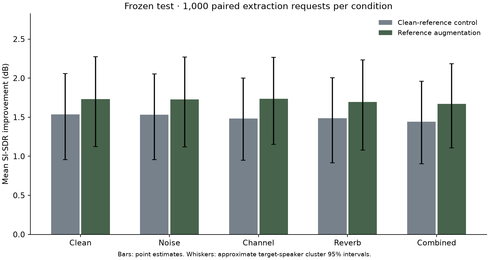
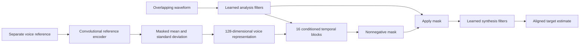

# One voice · Target Speaker Extraction

An independently implemented PyTorch system that estimates one person's voice from two overlapping speakers, guided by a separate voice sample. Includes training, data preparation, evaluation, a local API, and a browser audio workspace.

**Experimental research software.** It can select the wrong speaker and distort speech. The requested speaker must be present. Live microphone use and production speech quality are outside this release's claims.

The central experiment asks whether corrupting the reference during training improves extraction with a different channel or simulated room. Clean and augmented models share the architecture, initialization seed, mixture schedule, and training budget. There is no SpeakerBeam source, checkpoint, or dependency.

## Audio quality follow-up

Version 0.1.1 adds uniform output attenuation to keep sample peaks at or below 0.98 before WAV playback. A development audit found 58 of 400 raw outputs above full scale. This prevents output sample overflow; it does not improve speaker selection or remove model-generated artifacts. The network weights are unchanged. [Diagnosis, cleanup experiment and next training steps](docs/QUALITY_IMPROVEMENT.md).

An independently implemented STFT-mask model is now training on 231 speakers and 90.582 eligible source hours. At 10,000 updates, it scores 4.890 dB mean SI-SDR improvement and 0.6223 ESTOI on 400 development requests, versus 2.062 dB and 0.5387 for the original model. The app still serves the original weights pending final selection. [Quality development record](docs/QUALITY_WORKLOG.md).

The [research alignment audit](docs/RESEARCH_AUDIT.md) compares our implementation with SpeakerBeam, SpEx, Conv-TasNet and the enrollment-augmentation paper. This is a custom system informed by research, not a reproduction of their published architectures or training recipes.

## Frozen v0.1.0 results

Two models were trained for 5,000 updates each on an Apple M3 Pro. The selected model achieves **1.73 dB mean SI-SDR improvement** on 1,000 reserved test requests from 40 unseen speakers. Reference augmentation adds **0.22 dB** across mismatch conditions (approximate paired 95% interval: 0.07–0.39 dB; one training seed).

The delivered path worsens 29.1% of cases and triggers the speaker-confusion proxy in 14.6%; the original 5 dB quality target was not reached. This is a completed experimental pipeline with a modest measured gain. See the [model card](docs/MODEL_CARD.md) and [technical case study](docs/CASE_STUDY.md) for the full findings.

Warm processing of a repeated 60-second development recording takes **0.45 seconds on MPS** or **2.68 seconds on CPU**, including file decode and WAV encode. This is offline throughput, not live latency. Exact output length and agreement with whole-recording processing were verified at 10/30/60 seconds.



## Run locally

Python 3.12 and [uv](https://docs.astral.sh/uv/) are required. On the project Mac, the environment, public data, and training artifacts are in the ignored `.venv/`, `data/`, and `artifacts/` directories.

```sh
uv sync --frozen
uv run tse serve --device mps
```

Open <http://127.0.0.1:8000>. Select the development examples or supply a WAV/FLAC mixture up to 60 seconds and a separate 3–10 second voice reference. The interface provides waveform previews, synchronized original/output playback, and WAV download. Audio stays in the local service.

Use `--device cpu` without Apple MPS. The [local listening gallery](http://127.0.0.1:8000/gallery/) includes 20 fixed development requests with mixture, reference, known target, and model output, including successes and failures.

Serving requires `artifacts/releases/model.pt`, created by the study or export command. A fresh clone contains source and reports; raw audio and weights are not stored in Git. A missing model produces a not-ready state.

## Reproduce the study

```sh
uv sync --frozen
uv run python scripts/run_study.py --download --steps 5000 --device mps --evaluate-test
```

Use `--device cpu` without Apple MPS. The command downloads a bounded official LibriSpeech selection, audits splits, builds deterministic cases, checks learning on 16 fixed training cases, trains two models, compares them on development data, exports the selected model, and evaluates the reserved test. Omit `--evaluate-test` while developing. The runner refuses to silently repeat an already opened final test.

Training resumes from atomic checkpoints. The first execution requires substantial time and network access. The recorded machine is an Apple M3 Pro with 18 GiB memory. See the [reproduction guide](docs/REPRODUCING.md) for individual commands and recovery.

## What is implemented

- Audited public audio acquisition, SHA-256 manifests, speaker-disjoint splits, distinct reference utterances, and deterministic paired mixtures.
- A 1,223,296-parameter convolutional network with a reference encoder, feature-wise affine conditioning, a temporal separator, and learned analysis/synthesis filters. All weights start from random initialization.
- AdamW training, accumulation, clipping, explicit CPU/MPS devices, development checkpoint selection, verified CPU resume, and structured provenance.
- Target-specific SI-SDR improvement, speaker confusion, waveform error, five reference conditions, paired clustered uncertainty, duration/absence diagnostics, and reserved test cases.
- Bounded long-file inference, input validation, a local multipart API, and a responsive audio workspace.
- A dependency lock, automated tests, Linux CPU CI, wheel packaging, and a CPU container recipe.

This is an independent implementation and controlled engineering study. Established ideas and datasets are attributed in [sources](docs/SOURCES.md); the project does not claim to have invented target speaker extraction.

## Architecture



The model is noncausal and processes recorded audio offline. Processing faster than the recording duration does not establish suitability for live calls.

## Commands and checks

```sh
uv run tse --help
uv run tse extract --mixture conversation.wav --reference voice.wav --output isolated.wav --device cpu
uv run tse data audit
uv run ruff check src tests scripts
uv run ruff format --check src tests scripts
uv run pytest -q
uv build
```

The API exposes `GET /health`, `GET /ready`, `GET /model`, and `POST /extract` with multipart `mixture` and `reference` files. Successful responses contain a float WAV and an `X-TSE-Metadata` header. See `/docs` on the local server.

## Review the project

| Document | Purpose |
| --- | --- |
| [Model card](docs/MODEL_CARD.md) | Frozen test results, artifact identity, runtime and limitations |
| [Technical case study](docs/CASE_STUDY.md) | Research question, implementation choices and findings |
| [Reproduction guide](docs/REPRODUCING.md) | Data, training, inference, recovery and verification |
| [Implementation record](docs/IMPLEMENTATION.md) | Actual decisions and differences from the initial proposal |
| [Roadmap](docs/ROADMAP.md) | Delivery evidence and remaining research |
| [Original project plan](docs/PROJECT_PLAN.md) | Scope, hypotheses and proposed success criteria |
| [Original evaluation plan](docs/EVALUATION.md) | Experiment rationale and acceptance targets |
| [Sources](docs/SOURCES.md) | Data origins and primary research references |

Machine-readable results live in [`reports/`](reports/). Targets in the original proposal are not measured results. Quality claims must identify their split, checkpoint, and report.

Public source identities, frozen recipes and training records are in [`metadata/`](metadata/). Automated tests run locally and in Linux CPU CI. The v0.1.0 release also has a fresh noneditable wheel installation and real browser extraction through a non-root CPU container recorded in its verification reports.

## Data and licensing

Speech comes from [LibriSpeech / OpenSLR 12](https://www.openslr.org/12), distributed under [CC BY 4.0](https://creativecommons.org/licenses/by/4.0/). Examples are cropped, normalized, mixed derivatives; their local index retains source identifiers and attribution. No private recordings are included. This custom protocol is not the official Libri2Mix benchmark.

A license for original project code has not been selected. Public visibility alone does not grant an open-source license. Dependencies and data retain their respective licenses; weights remain local to this workspace.
