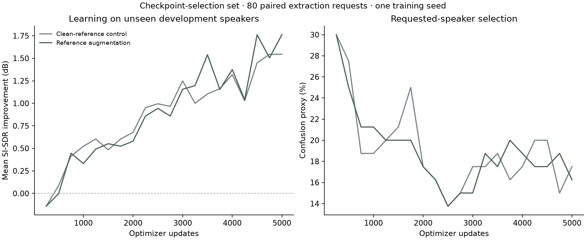

# Case study · Keeping one voice

The product accepts an overlapping recording and a separate sample of the person the user wants to hear. A useful system must both separate speech and follow that reference when the same mixture is requested twice with different speakers. This requires learned waveform processing, not a language-model wrapper.

## What was built

The project implements its own 1.22M-parameter reference encoder and conditioned temporal separator in PyTorch, trains from random initialization, and delivers an aligned audio estimate through a local API and browser comparison workspace. Data acquisition, auditable mixture recipes, metrics, checkpoint recovery, CPU/MPS execution, and packaging are part of the system. Research ideas are attributed; SpeakerBeam code and pretrained weights are not dependencies.

The main engineering question was whether independent reference corruption during training improves mismatch robustness. Clean and augmented runs use identical architecture, seed, source/crop schedule, effective batch, and 5,000-update budget. The four mismatch families are weighted equally. Checkpoint and product selection use development data; hashes identify both frozen artifacts before final test evaluation.

## Evidence and result

The tiny 16-case paired diagnostic reaches 11.85 dB improvement, showing that the network can learn the task. It is not evidence of generalization. Held-out evaluation is substantially harder.

On the 400-case development report, reference augmentation changes equally weighted mismatch improvement by +0.25 dB. The predeclared rule selects **augmented** for delivery. On the reserved test, the corresponding augmentation change is +0.22 dB. The selected model's clean mean is 1.73 dB, with 29.0% negative-improvement cases and 14.6% confusion. The complete tables, paired intervals, and exact artifact identities are in the [model card](MODEL_CARD_V0_1.md).

The difference between tiny-set learning and unseen-speaker quality is a central finding. A working loss and a convincing single example are insufficient release evidence. This pilot uses one training seed and a small archive-order speech selection. Its results support a bounded experimental system; they do not establish general state-of-the-art speech extraction or a robust augmentation gain.

## Decisions that mattered

1. **Separate reference utterances and paired requests.** These prevent direct waveform reuse and reveal a separator that consistently chooses only the easier voice.
2. **A gain-sensitive loss alongside SI-SDR.** Waveform L1 anchors amplitude; test reports retain both separation and gain-sensitive metrics.
3. **Per-frame normalization and bounded context.** Padding does not affect global statistics, and long-file processing can be checked numerically against whole-file output.
4. **Independent augmentation RNG.** Treatment changes the reference while retaining the control's mixture schedule, enabling paired comparisons.
5. **A real delivery-path evaluation.** The final artifact is scored after the same decoding, normalization and WAV output operations used by the app.
6. **Explicit target-absence failure.** Energy diagnostics expose emitted competing speech when the desired speaker is missing, without fabricating a confidence score.

## What a reviewer can run

The [reproduction guide](REPRODUCING.md) provides setup, training, evaluation, export, serving and recovery commands. The [metadata directory](../metadata/) preserves public utterance IDs, hashes, frozen case recipes and training records. Tests exercise signal invariants, reference gradients, checkpoint resume, API errors, and long-file alignment. A fresh noneditable wheel and CPU container were exercised locally; GitHub Actions checks the CPU code path.

The app's default examples are the first development mixture with both references, selected by manifest order rather than score. Per-case test scores remain available for inspecting failures. There was no formal human listening study.

## Next research decisions

The measured generalization gap motivates more speaker diversity and longer training, with multiple paired seeds before claiming an augmentation effect. Reference corruption should also be tested on separately acquired real microphone/room recordings with appropriate consent. A calibrated target-presence objective is needed before absent-speaker use. Streaming would require a causal architecture and a separate latency/quality study. These are research extensions, not concealed capabilities of this release.
