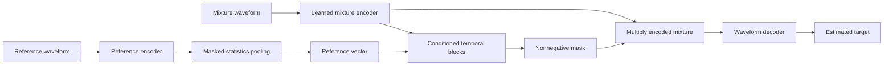

> Original planning record. For the implemented system, see [IMPLEMENTATION.md](IMPLEMENTATION.md), [REPRODUCING.md](REPRODUCING.md), and the measured reports. Proposed targets below are not current capability claims.

# Model design

This is a proposed design for independent implementation. No code, weights, measured parameter count or runtime exists yet. Defaults are recorded in [pilot.toml](../configs/pilot.toml).

## 1. Task and interface

Learn `estimated_target = f(mixture, reference, valid_lengths)`.

| Tensor | Shape | Meaning |
| --- | --- | --- |
| Mixture | `[B, 1, T]` | Mono waveform at 16 kHz |
| Reference | `[B, 1, R]` | Different utterance by the selected speaker |
| Target | `[B, 1, T]` | Ground-truth selected source at mixture scale |
| Mixture lengths | `[B]` | Number of valid samples before padding |
| Reference lengths | `[B]` | Valid reference samples |
| Output | `[B, 1, T]` | Estimated target, same timeline and exact sample count |

Training receives the ground-truth target; inference never does. Speaker IDs can supervise a training-only auxiliary head, but IDs are not required at inference and do not choose the output channel.

## 2. Initial architecture

Use a compact time-domain model with a reference-conditioned temporal convolutional network. Convolutional separation and affine conditioning are established ideas; see [Sources](SOURCES.md). Our implementation, parameter choices and experiments will be maintained here.



### Mixture encoder

- One learnable 1D convolution from 1 to 128 channels.
- Kernel length 32 samples, stride 16 samples at 16 kHz.
- ReLU to form nonnegative latent features.
- Explicit padding and a matching transposed-convolution decoder, followed by exact length restoration.

This is approximately one latent frame per millisecond. A 2-second crop has roughly 2,000 frames; activations, not just parameter count, matter for memory.

### Reference encoder

- An independent 1D convolutional stem: 128 channels, kernel 160 samples and stride 80 samples, followed by three residual temporal blocks with dilations 1, 2 and 4.
- Reduce reference temporal resolution if needed after profiling.
- Masked mean and standard-deviation pooling over valid speech frames.
- A projection into a 128-dimensional reference vector, with epsilon-stabilized normalization.
- Cache this vector during inference when processing multiple chunks with the same reference.

Learn this encoder jointly from scratch. In the first design, the mixture and reference encoders do not share weights; weight sharing is a later ablation, not an implicit default.

### Conditioned separator

- Bottleneck width 64, internal width 128, skip width 64.
- Two repeats of eight temporal blocks with dilations `1, 2, 4, 8, 16, 32, 64, 128`.
- Depthwise temporal kernel length 3, residual and skip connections, nonlinearities and normalization.
- Each block receives affine modulation from the reference vector: `h' = gamma(reference) * h + beta(reference)`.
- Aggregate skip outputs and predict a 128-channel nonnegative mask using ReLU.
- Multiply the mask by the mixture's encoded features; decode one target waveform.

The mask is not a probability or confidence score. Allowing values above 1 avoids treating destructive interference as a strict bounded-mask problem.

The pilot is noncausal and may use time-spanning normalization. Its output cannot be advertised as live streaming. The dilated convolutions provide about a second of convolutional context with these defaults; normalization can introduce wider dependence.

### Size constraints

Aim below 3 million trainable parameters. Count parameters and measure memory after implementation. If the budget fails, reduce block count or widths before changing data sample rate. A smaller model that learns the correct target is more informative than a large unstable model.

## 3. Why this starting point

- Real-valued convolutions keep the first device-compatibility check focused.
- Reference conditioning exposes a testable mechanism: swapping references should change the extracted speaker.
- A compact model permits controlled experiments under a laptop budget.
- Waveform output makes listening tests and downstream inference direct.

It is a starting hypothesis, not a guarantee of adequate quality. If a tiny-set learning test fails, debug data, losses and conditioning before moving to another architecture.

## 4. Training losses

### Main target-present objective

Use negative scale-invariant signal-to-distortion ratio, SI-SDR. Center valid samples, project the estimate onto the target and compare projected-target energy with residual energy:

```text
s = target - mean(target over valid samples)
e = estimate - mean(estimate over valid samples)
alpha = dot(e, s) / (dot(s, s) + epsilon)
projected = alpha * s
residual = e - projected
SI_SDR = 10 * log10((sum(projected^2) + epsilon)
                   / (sum(residual^2) + epsilon))
loss = -SI_SDR
```

Specify epsilon and numerical conventions in code and reports. Padding must not participate in means or energies. Clamp or reject degenerate cases according to a documented policy; do not silently average invalid scores.

SI-SDR does not constrain overall amplitude. Monitor waveform scale, clipping and a gain-sensitive reconstruction metric. Start with the main loss alone, then test a small scale-sensitive L1 or spectral term if amplitude or perceptual artifacts justify it. This change is a named experiment, not an unreported fix.

### Optional speaker supervision

If the reference vector collapses or fails to carry identity, evaluate an auxiliary classification head over training speakers, initially weighted at 0.1 relative to the main objective. It is used only during training and excluded from inference. Unseen speakers remain the real evaluation condition.

Compare this auxiliary objective against the same architecture without it. Classification accuracy on known training speakers is not a substitute for extraction quality.

### Target absence

SI-SDR is undefined or uninformative for an all-zero target. Do not pass absent-target examples into the normal objective and call the result valid. A later extension may combine a balanced presence loss with output-energy suppression on absent cases. Calibration and false-suppression analysis are required before enabling output gating.

## 5. Training schedule

1. **Operator check:** random tensors through forward/backward on CPU and MPS, finite gradients, exact shapes.
2. **Tiny-set check:** 16 fixed speech cases, stable references, no corruption. Verify actual learning and target switching.
3. **Pilot:** 1,000 optimizer updates on the selected training speakers, with deterministic development cases.
4. **Control:** expand the data only if the pilot generalizes; keep references clean.
5. **Robustness run:** same architecture, paired training seed/mixture schedule and update budget; change reference augmentation only.
6. **Ablations:** change one design choice at a time after the main comparison works.

Initial optimizer proposal: AdamW, learning rate `3e-4`, weight decay `1e-4`, gradient clipping at norm 5, float32, microbatch 2, accumulation 4. Accumulation produces an effective batch of 8 examples; average losses correctly across microbatches. Start with no learning-rate schedule in the pilot to keep diagnosis simple.

Validate every 250 optimizer updates and retain best and latest checkpoints. An initial 10,000-update comparison budget is provisional and must be adjusted from measured throughput before launch. Allocate equal optimizer updates and comparable data exposure to control and treatment.

Set all seeds and save random generator states, sampler position, optimizer state and scheduler state if applicable. Deterministic data generation is required; bitwise identity across CPU and MPS is not assumed. Record numerical tolerances and any nondeterministic operations.

## 6. Inference design

### Whole clip

Use whole-clip inference first for short inputs. Validate audio, resample with a fixed method, encode the reference once, estimate the target, undo any documented common preprocessing gain, and restore exact duration. Do not independently normalize each output clip when calculating gain-sensitive metrics.

### Bounded-memory inference

Once the model works, evaluate 4-second windows with overlap and a context margin. Blend overlap regions with normalized weights; keep the same reference vector and gain convention for the entire recording. Correct the final partial window and preserve timing.

Noncausal normalization can make chunked and whole-clip outputs differ. Measure that difference, boundary artifacts and target consistency before selecting window length and overlap. Chunked inference is not automatically equivalent to streaming or to the full-clip model.

### Device and optimization

Maintain CPU and MPS paths. Avoid implicit CPU fallback during published timing. Synchronize the accelerator when measuring. Lower precision, quantization, compilation and Core ML export are later experiments; each requires an output-quality and compatibility check against the float32 reference.

## 7. Required model checks

- Output shape matches every valid input length, including lengths not divisible by the stride.
- Padding does not affect reference pooling or masked losses.
- A finite optimizer step changes parameters on both supported devices.
- A saved and reloaded model reproduces outputs within tolerance.
- Correct and swapped references cause the expected target selection after learning.
- Silent and invalid references generate a defined validation response.
- No target waveform, future evaluation label or speaker ID leaks into inference.
- Gradients reach the reference encoder as well as the mixture separator.

The exact implementation layout and testing phases are in [ENGINEERING.md](ENGINEERING.md).
