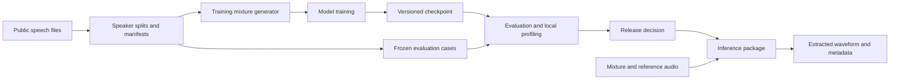

> Original planning record. For the implemented system, see [IMPLEMENTATION.md](IMPLEMENTATION.md), [REPRODUCING.md](REPRODUCING.md), and the measured reports. Proposed targets below are not current capability claims.

# Project plan

Plan version: 1.0. Date: 2026-09-06. Current phase: repository foundation.

## 1. Objective

Build and evaluate a local target speaker extraction system. A user supplies an overlapping conversation and a separate reference voice clip. A learned model estimates the selected person's waveform.

The project should demonstrate the work expected of a machine learning engineer: data contracts, model implementation, reproducible training, defensible evaluation, efficient inference, and a usable interface. The portfolio should explain what improved, what failed, and which tradeoffs were measured.

## 2. Intended user and workflow

The initial user is someone cleaning a short interview, meeting excerpt, or personal recording where two voices overlap.

1. Select a WAV or FLAC recording, up to 60 seconds in the first interface.
2. Supply a separate 3–10 second example of the desired voice.
3. Inspect input validation messages, including inadequate speech or unsupported audio.
4. Run extraction locally and listen to the original and extracted audio with synchronized playback.
5. Download the output and inspect processing time and model version.

The system estimates audio from acoustic evidence. It is not a transcription, a voice generator, or a guarantee that every spoken word can be recovered.

## 3. Scope

### First complete version

- Two speakers, one selected target, one-channel mixtures.
- 16 kHz internal sample rate and floating-point processing.
- A target-present operating assumption for the first trained model, stated in the interface.
- A separate reference utterance, not a crop of the target utterance in the mixture.
- Our own compact network, trained without SpeakerBeam code or checkpoints.
- On-demand training mixtures from public speech, deterministic development and test mixtures.
- Evaluation on speakers held out from training, with clean and corrupted reference conditions.
- A command-line inference path, local API, and a small audio comparison interface.
- A reproducible report, model card, failure examples, and performance measurements on this Mac.

### Later extensions

- Explicit target-absent detection and output suppression, after calibration and evaluation.
- Longer files with stable boundaries and bounded memory.
- Three or more speakers; different languages; measured microphone/room recordings.
- Causal streaming, cacheable reference embeddings, and deployment format optimization.

These extensions have separate acceptance gates. Finishing the first version does not imply they work.

## 4. Research question

**Can a compact model trained locally extract the correct speaker when the reference clip has different acoustic conditions from the mixture?**

The primary intervention is independent augmentation of reference audio during training. The control model sees the same training examples, model size, optimizer settings, and update budget, with clean references. Both models see exactly the same evaluation cases.

Secondary questions:

- Does the model actually follow the reference, or simply extract the loudest speaker?
- How much does reference duration affect quality and target selection?
- What quality is lost when reducing model size or inference cost?
- How often does an unfamiliar or absent reference cause extraction of another person?

Reference augmentation and target extraction already have research literature. Our contribution is an independently implemented, resource-bounded system and a transparent experimental study. A null result is still a result; it must not be rewritten as an improvement.

## 5. Ownership of the work

| Component | Approach |
| --- | --- |
| Public speech and mixture definitions | Use with source and license attribution |
| Neural network, conditioning, losses and training loop | Implement in this repository using general PyTorch operations |
| Model weights | Train from random initialization for the main experiment |
| Dataset indexing, custom mixtures and corruption pipeline | Implement here; clearly label custom evaluation protocols |
| SpeakerBeam | Read and cite as prior work; no source or weights in the core implementation |
| External pretrained models | Optional future comparison tools only, separately labeled and licensed |
| Numerical and audio libraries | Normal dependencies, pinned after compatibility is tested |

An implementation can use established architecture ideas without being a new scientific architecture. Credit those ideas and describe the changes precisely.

## 6. Proposed system

The API and demo call the same inference package evaluated offline. Training, evaluation, and serving share audio conventions but do not share mutable data splits.

## 7. Success criteria

These are proposed project targets, not measured results. Use development data to finalize thresholds before the final test protocol is frozen. Record any changes and reasons.

| Area | Initial target or gate |
| --- | --- |
| Correctness | Finite gradients, exact output length, functioning reference conditioning, no speaker leakage across splits |
| Learning | Overfit 16 fixed training examples with a clear improvement over initialization; verify reference swaps change the selected speaker |
| Pilot quality | Positive held-out SI-SDR improvement over returning the mixture, with a confidence interval reported |
| First useful model | Aim for at least 5 dB mean SI-SDR improvement on the declared custom clean target-present test; report median and failures too |
| Robustness contribution | Aim for at least 1 dB paired mean improvement on the prespecified mismatched-reference suite over the clean-reference control |
| Clean-quality tradeoff | Aim to lose no more than 0.5 dB on clean references while improving mismatch performance |
| Speaker selection | Report confusion and swapped-reference checks; improvements cannot be explained by ignoring the reference |
| Inference | Profile 10, 30 and 60 second clips; aim for warm real-time factor below 1 on the M3 Pro, subject to measurement |
| Product | Reliable local file processing, clear errors, repeatable output and a documented operating envelope |
| Reproducibility | Another developer can reconstruct a run from configuration, manifest, environment lock and code commit |

The first useful-model target is not a comparison with a published Libri2Mix score. Our custom mixture recipe differs. If targets are not met, publish measured limits and decide whether to improve the model or narrow the claimed operating envelope.

## 8. Machine and resource budget

Observed at setup: Apple M3 Pro, 12 CPU cores, 18 GiB unified memory, about 44 GiB free disk. Native ARM Python 3.12.5, Git, GitHub CLI and `uv` are present. PyTorch and model performance have not been validated.

| Resource | Planning rule |
| --- | --- |
| Python | Use native ARM Python 3.12 in an isolated project environment |
| Accelerator | Try MPS; maintain a correct CPU path and record any unsupported operations |
| Precision | Begin with float32; test lower precision only after stable baseline results |
| Training | Start with 2-second crops, batch 2, gradient accumulation 4; increase crops to 4 seconds only after profiling |
| Reference | Start with 5 seconds; later compare 1, 3, 5 and 10 seconds where available |
| Model | Initial design budget below 3 million parameters; count actual parameters after implementation |
| Memory | Aim below 10 GiB process RSS and preserve OS headroom; record MPS allocator/driver metrics separately because memory is unified |
| Disk | Preserve at least 15 GiB free; keep persistent project artifacts within a 20 GiB working budget initially |
| Data | Keep compressed speech files; decode individual crops and generate mixtures on demand |
| Checkpoints | Keep best and latest during a pilot; retain final comparison checkpoints intentionally rather than every epoch |
| Run time | Benchmark 100 measured steps after warmup, then estimate a 1,000-step pilot and larger update budgets |

Temporary archives, extracted data, `uv` caches and checkpoints all count against real disk availability. Measure peak download/extraction needs before starting. Do not execute the default full LibriMix generation script on this disk budget.

## 9. Delivery sequence

1. Establish a clean native environment and benchmark the proposed operations.
2. Build reproducible, speaker-disjoint data and simple signal baselines.
3. Implement the reference-conditioned network and prove it learns on a tiny set.
4. Train a clean-reference control and establish held-out performance.
5. Run the reference-robustness experiment, ablations and failure analysis.
6. Package bounded-memory inference and build the local API and interface.
7. Audit the final evaluation, produce a model card and publish portfolio evidence.

The detailed backlog is in [ROADMAP.md](ROADMAP.md). A planning estimate is 8–12 weeks of part-time work, with roughly 80–120 focused engineering hours plus training time. This is a scope estimate, not a completion promise; revise it after the first training benchmark.

## 10. Risks and decisions

| Risk | Early evidence | Response |
| --- | --- | --- |
| Model ignores the reference | Similar output after swapping references | Fix conditioning/data balance before scaling training |
| Speaker features memorize readers or recording channels | Training improves while new speakers fail | Audit splits and references; vary acoustic conditions; assess auxiliary loss |
| MPS execution is slow or unsupported | Forward/backward benchmark | Replace unsupported operation, reduce model/crop size, or use a documented CPU path |
| Dataset exceeds available disk | Measured peak storage estimate | Stream selected members, retain FLAC, remove only disposable caches |
| Corruption creates an unrealistic task | Listening audit and severe clean-quality loss | Reduce severity and distinguish simulated mismatch from real microphones |
| Target absence produces another person's voice | Absent-reference evaluation | State the limitation; develop and validate presence handling separately |
| Good short-clip scores but poor long files | Boundary artifacts or speaker switches | Test reference caching and context/crossfade strategy before interface release |
| Metric gains are inaudible or misleading | Failure clips and gain-sensitive metrics | Report multiple measures and blinded listening comparisons |

## 11. Completion definition

The project is complete when the claimed operating envelope has reproducible results, a working local interface, a documented model artifact, and an honest account of limitations. A polished interface alone does not complete the ML work, and a notebook alone does not complete the product work.
